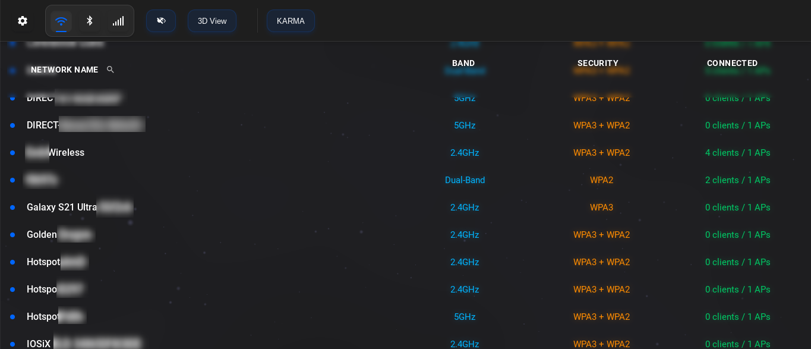

  <h1><strong>RF-Lockpick</strong></h1>
  

    
  

---

# Built With

### Core Tools
[Bluetoolkit](https://github.com/sgxgsx/BlueToolkit)  
[hxcdumptools](https://github.com/ZerBea/hcxdumptool)  
[Wifite2](https://github.com/derv82/wifite2)  
[Kismet](https://www.kismetwireless.net/)  
[aircrack-ng suite](https://www.aircrack-ng.org/)  
[tcpdump](https://www.tcpdump.org/)  
[hostapd](https://w1.fi/hostapd/)  

### Frontend

### Backend

---

# Features

## WiFi View
Lists all available networks  
Select a network to view the 3D ThreeJS scene for network visualization  
Automates handshake capture and cracking  
Creates Evil-Twin AP attacks using cracked PSKs  

## WiFi Karma View  
Displays all probing SSIDs  
Automates creation of Karma-AP attacks using ThreeJS scene  
Captures probing handshakes for cracking  

## Bluetooth View
Displays list of Bluetooth devices and collected data  
Runs extensive recon to gather verbose device capability information  

## Cellular View
*Not currently implemented*

---

# Settings
Select network interfaces in settings menu

